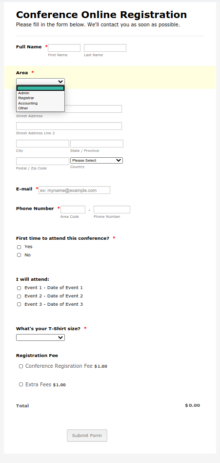

# Forms

HTML form elements work a little bit differently from other DOM elements in React, because form elements naturally keep some internal state.  
or example, this form in plain HTML accepts a single name:

```html
<form>
  <label> Name: <input type="text" name="name" /> </label>
  <input type="submit" value="Submit" />
</form>
```

Forms can have `Uncontrolled components` as well as `Controlled components`.  
[Explaination](https://goshakkk.name/controlled-vs-uncontrolled-inputs-react/#conclusion)

## Uncontrolled Component

There is no attempt to directly control the state of this component or what the user can type into the input. Since the component is uncontrolled, we don’t really have a way of interacting with state as well.

```html
<input type="text" defaultValue="foo" ref="{inputRef}" />

OR

<input type="text" />
```

## Controlled Component

The value of the input is explicitly defined by state.

```html
<input type="text" value="{value}" onChange="{handleChange}" />
```

| Element                     | Value property         | Change callback | New value in the callback |
| --------------------------- | ---------------------- | --------------- | ------------------------- |
| `<input type="text" />`     | `value="string"`       | `onChange`      | `event.target.value`      |
| `<input type="checkbox" />` | `checked={boolean}`    | `onChange`      | `event.target.checked`    |
| `<input type="radio" />`    | `checked={boolean}`    | `onChange`      | `event.target.checked`    |
| `<textarea />`              | `value="string"`       | `onChange`      | `event.target.value`      |
| `<select />`                | `value="option value"` | `onChange`      | `event.target.value`      |

## useRef Hook

`Refs` provide a way to access DOM nodes or React elements created in the render method.

### When to Use Refs

There are a few good use cases for refs:

- Managing focus, text selection, or media playback.
- Triggering imperative animations.
- Integrating with third-party DOM libraries.

## Implement below template

- ### add validations

- ### perform calculation and show the total at the end

- ### On submitting the form show the entered data in a confirmation popup

[Template](https://www.jotform.com/form-templates/conference-online-registration-form)  


This project was bootstrapped with [Create React App](https://github.com/facebook/create-react-app).

## Available Scripts

In the project directory, you can run:

### `yarn start`

Runs the app in the development mode.<br />
Open [http://localhost:3000](http://localhost:3000) to view it in the browser.

The page will reload if you make edits.<br />
You will also see any lint errors in the console.

### `yarn test`

Launches the test runner in the interactive watch mode.<br />
See the section about [running tests](https://facebook.github.io/create-react-app/docs/running-tests) for more information.

### `yarn build`

Builds the app for production to the `build` folder.<br />
It correctly bundles React in production mode and optimizes the build for the best performance.

The build is minified and the filenames include the hashes.<br />
Your app is ready to be deployed!

See the section about [deployment](https://facebook.github.io/create-react-app/docs/deployment) for more information.

### `yarn eject`

**Note: this is a one-way operation. Once you `eject`, you can’t go back!**

If you aren’t satisfied with the build tool and configuration choices, you can `eject` at any time. This command will remove the single build dependency from your project.

Instead, it will copy all the configuration files and the transitive dependencies (webpack, Babel, ESLint, etc) right into your project so you have full control over them. All of the commands except `eject` will still work, but they will point to the copied scripts so you can tweak them. At this point you’re on your own.

You don’t have to ever use `eject`. The curated feature set is suitable for small and middle deployments, and you shouldn’t feel obligated to use this feature. However we understand that this tool wouldn’t be useful if you couldn’t customize it when you are ready for it.

## Learn More

You can learn more in the [Create React App documentation](https://facebook.github.io/create-react-app/docs/getting-started).

To learn React, check out the [React documentation](https://reactjs.org/).
